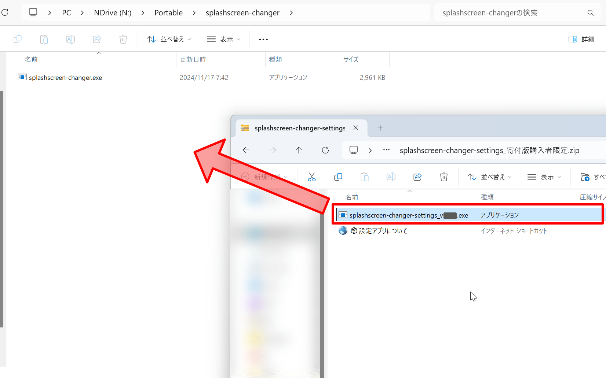
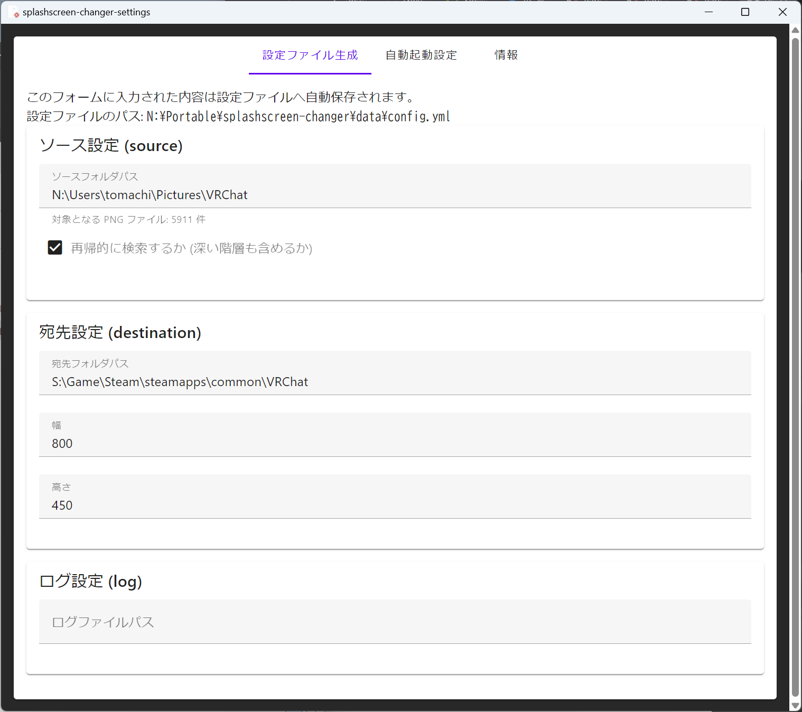

# 設定アプリ (splashscreen-changer-settings)

Booth から寄付版を購入いただいた方限定で、splashscreen-changer の設定 を GUI で行えるアプリケーションを配布しています。

## インストール方法

Booth で寄付版を購入後、[Booth ライブラリ](https://accounts.booth.pm/library) にアクセスします。  
`splashscreen-changer-settings_寄付版購入者限定.zip` というファイルをダウンロードして、展開します。

展開すると、以下のように `splashscreen-changer-settings_v{X.Y.Z}.exe` というファイルが入っているので、`splashscreen-changer.exe` を入れているフォルダと同じ階層にコピーします。

`splashscreen-changer-settings_v{X.Y.Z}.exe` をダブルクリックすることで、設定アプリを開けます。

## 機能

このアプリケーションでは、以下の機能を提供します。

- 設定ファイルの生成・編集
- 自動起動の設定

### 設定ファイルの生成・編集

このタブでは、[設定ファイル](../settings/file.md) ページで説明されている項目について設定することができます。

入力した値は、それぞれの入力欄からフォーカスを外す（ほかの入力欄をクリックする）と保存されます。  
設定ファイルの場所は splashscreen-changer と同じ仕組みで決定され、格納されます。

### 自動起動の設定

このタブでは、[自動起動](../settings/autostart/index.md) ページで説明されている自動起動の設定を行えます。

!!! abstract
    この機能は現在未実装です。
