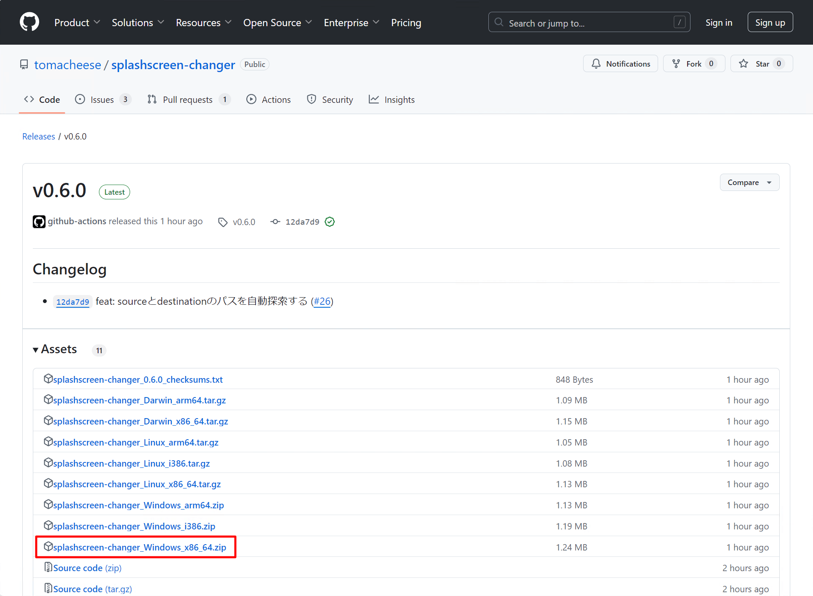
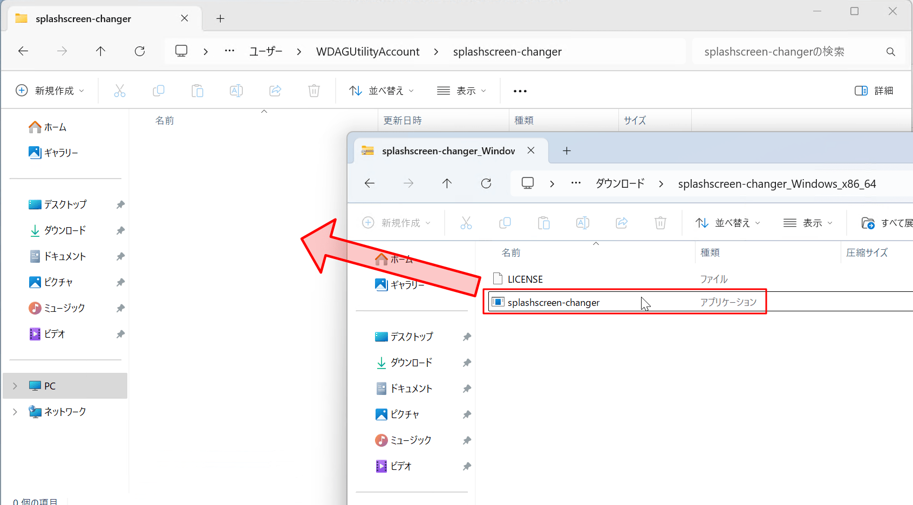

# 実行ファイルによるポータブルインストール

このページでは、splashscreen-changer を実行ファイルによるポータブルインストールする場合の手順について説明しています。

!!! info "Windows 以外の OS を利用している方へ"
    このアプリケーションは複数の OS に対応しています。  
    しかしながら、このページにおいては便宜上 Windows 64 bit 環境を使用しているユーザー向けに記載しています。  
    他の OS を利用している場合は、適宜読み替えてください。

## 1. リリースページにアクセスしダウンロード

まず、[リリースページ](https://github.com/tomacheese/splashscreen-changer/releases/latest) にアクセスします。

アクセスすると以下のように、Assets という欄があります。  
ここから `splashscreen-changer_Windows_x86_64.zip` を探し、クリックしてください。

## 2. ダウンロードしたファイルを展開し任意の場所に格納

ダウンロードしたファイルをダブルクリックして開くと、中に `splashscreen-changer.exe` というファイルがあります。  
設定によっては最後の `.exe` は表示されていないかもしれません。  
このファイルをコピーし、お好きなところにペーストしてください。

ここでは、ユーザーフォルダに `splashscreen-changer` というフォルダを作成し、その中にペーストしました。

## 4. 設定ファイルの作成

このアプリケーションは、なにも設定しない場合次のような動作をします。  
**これらの動作を変更したい場合は、設定ファイルの作成が必要** です。そうでない場合は、次に進んでください。

- 元画像のフォルダ: ピクチャーフォルダ内の VRChat フォルダ（VRChat 内でカメラを使って写真を撮った時に保存されるフォルダ）
- スプラッシュスクリーンを変更するアプリケーション: VRChat
- 変換後の画像サイズ: 800x450

!!! tips
    あなたが、「VRChat 内で撮った写真の中からランダムで画像を選んで、VRChat 起動時に出てくるスプラッシュスクリーンにしたい！」のであれば、このままで大丈夫です。  
    そうではなく、**選別した画像の中からランダムで選んでほしい場合** や、**VRChat 以外の EasyAntiCheat が導入されたアプリケーションで利用したい場合** は、設定ファイルの作成が必要になります。

設定ファイルに関して詳しくは、[設定ファイル](../settings/file.md) ページをご覧ください。

## 5. 自動起動の設定

このアプリケーションは、実行するたびにランダムに画像を設定します。  
そのため、なんらかの条件で定期的にスプラッシュスクリーンを変えたいという場合は、設定が必要です。

以下の方法をおすすめしています。

1. スタートアップへ登録し、PC が起動するたびに画像が変更される
2. タスクスケジューラーを用いて、定期的に画像が変更される
3. VRCX の「アプリケーションの自動起動」機能を用いて、VRChat が起動するたびに画像が変更される

これらの具体的な設定方法については、[自動起動](../settings/autostart/index.md) ページをご覧ください。
