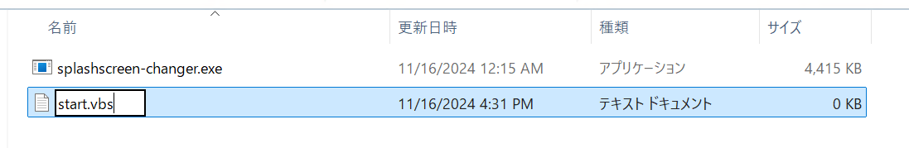

# スタートアップへの登録

!!! info
    このページの内容は、Windows でのみ利用可能です。

PC が起動するたびにスプラッシュスクリーンを変更したい場合、Windows のスタートアップという機能を利用して実現可能です。  
以下の方法で設定できます。

1. VBS ファイルを作成し、splashscreen-changer をバックグラウンドで起動できるようにプログラムを設定
2. VBS ファイルへのショートカットファイルを作成
3. ショートカットファイルをスタートアップフォルダにコピー

## 1. VBS ファイルを作成

実行ファイル (exe) があるフォルダと同じ階層に、`start.vbs` というファイルを作成します。  
このファイルを作成することで、splashscreen-changer をバックグラウンドで起動することができます。

まず、拡張子を含めてファイル名を変更する必要があるため、拡張子を表示します。  
エクスプローラーを開き、`表示` → `表示` → `ファイル名拡張子` を有効にしてください。


つぎに、実行ファイルがあるフォルダで右クリックし、`新規作成` → `テキスト ドキュメント` をクリックします。


ファイルが作成され、ファイル名の入力画面になります。ここで、`start.vbs` と入力します。  
なお、拡張子 `vbs` だけがあっていれば、`start` の部分は何にしてもかまいません。



ファイル名を変更すると、以下のダイアログが出ます。問題ないので、`はい` をクリックします。


## 2. VBS ファイルに起動プログラムを書き込む

作成した `start.vbs` を右クリックし、`プログラムから開く` → `別のプログラムを選択` をクリックします。


`アプリを選択して .vbs ファイルを開く` というダイアログが表示されるので、`メモ帳` をクリックしたあと `一度だけ` をクリックします。


開いたメモ帳で、以下のプログラムを書き込み、保存してください。

```vb
Set ws = CreateObject("Wscript.Shell")
ws.run "cmd /c splashscreen-changer.exe", 0, False
```


!!! tips
    ここで作成した `start.vbs` をダブルクリックで実行したとき、`splashscreen-changer.exe` を実行したときと同じように動作することの確認をお勧めします。

## 2. VBS ファイルのショートカットファイルを作成

作成した `start.vbs` ファイルを右クリックし、`その他のオプションを確認` をクリックします。


別のメニューが表示されるので、`ショートカットの作成` をクリックします。


`start.vbs - ショートカット` というファイルが作成されます。`start` などと名前を変えておきましょう。


## 3. スタートアップフォルダに格納

作成した `start` ショートカットファイルを、スタートアップに登録しましょう。  
スタートアップへの登録は、特定のフォルダに格納することで登録できます。

別のウィンドウで、エクスプローラーを開きます。  
アドレス欄に、`shell:startup` と入力し、Enter を押します。


`スタートアップ` フォルダが開くので、ここに先ほど作成したショートカットファイルをコピーして格納します。


ここまで設定することで、PC の起動時にスプラッシュスクリーンが変更されるようになりました。
